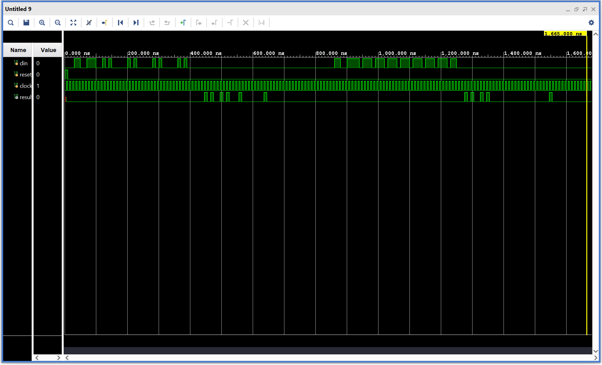

# Serial BCD Calculator

A stream-in/stream-out 4-digit BCD adder/subtractor in Verilog. The design
detects a header pattern in a continuous serial bit stream, deserializes an
operation bit and two 4-digit BCD operands, performs decimal addition or
subtraction, and serializes a framed 5-digit BCD result. Everything is written
from scratch; no vendor IP.

Simulated in Xilinx Vivado 2025.2.

---

## Interface

Top-level module `Project3`.

| Signal | Dir | Width | Description |
|---|---|---|---|
| `din` | in | 1 | Serial input, MSB first, one bit per rising edge |
| `reset` | in | 1 | Active-high synchronous reset |
| `clock` | in | 1 | Free-running clock |
| `result` | out | 1 | Serial output, MSB first; idles low |

There is no framing strobe in either direction. Packet boundaries are
recognized from the data itself.

### Input packet (41 bits)

```
8'h67  op  A[15:0]  B[15:0]
```

- `8'h67` (`01100111`) is the start-of-packet header.
- `op` = 0 for `A + B`, 1 for `A − B`.
- `A` and `B` are 4-digit packed BCD, most significant digit first.

### Output packet (28 bits)

```
8'hA5  R[19:0]
```

- `8'hA5` (`10100101`) is the output header.
- `R` is the 5-digit packed BCD result. The fifth (most significant) digit
  carries the addition overflow, e.g. 5050 + 5050 = 10100.

Worked example, `3627 + 1287`:

```
in:   01100111_0_0011_0110_0010_0111_0001_0010_1000_0111
out:  10100101_0000_0100_1001_0001_0100              (= 04914)
```

---

## Architecture

Four modules under `Project3`, coordinated by handshake signals rather than a
central state machine:

| Module | Role |
|---|---|
| `packetchecker` | 8-bit shift window compared against `8'h67`; raises `packet_match` for one cycle. Held off (window cleared) while a payload is being captured. |
| `sipo_store` | Serial-in/parallel-out capture of the 33-bit payload into `op`, `A`, `B`; asserts `capture_active` during capture and pulses `sipo_done` when complete. |
| `BCD_ALU` | Combinational 4-digit BCD add and subtract with an output mux selected by `op`. |
| `piso_out` | Parallel-in/serial-out shifter that loads `{8'hA5, result}` on `sipo_done` and streams 28 bits. |

Data flow: `din` → `packetchecker` → `sipo_store` → `BCD_ALU` → `piso_out` →
`result`.

### Header detection and non-overlapping capture

`packetchecker` shifts `din` into an 8-bit window on every edge and registers
`packet_match` high for the cycle after the window becomes `8'h67`. During that
cycle the first payload bit (`op`) is on `din`, so `sipo_store` sees
`packet_match`, starts capturing on that edge, and counts 33 bits.

While `sipo_store` is capturing, its `capture_active` output drives the
checker's `hold_off` input, which clears the window and suppresses matches. This
makes header detection non-overlapping: a `01100111` bit pattern that happens
to occur inside `A` or `B`, or straddling the two, cannot be mistaken for a new
header and restart the capture mid-payload. Once the 33rd bit is in, `hold_off`
drops, the window starts empty, and the next header is recognized as soon as
its eight bits have arrived, so packets can be sent back to back with no idle
gap.

### Decimal arithmetic

Built up structurally:

```
FA (dataflow) → 4-bit RCA → BCDadd_1d (digit adder, add-6 correction) → BCDadd_4d (4-digit chain)
```

Each `BCDadd_1d` adds two digits in binary with one ripple-carry adder, adds
`0110` with a second, and selects the corrected sum (and asserts carry-out) when
the binary sum exceeds 9 or produced a carry. Four of these chain into
`BCDadd_4d`; the final decimal carry becomes the fifth result digit.

Subtraction uses ten's complement. `BCDsub_4d` forms the 9's complement of each
digit of `B` (`9 − digit`), then feeds `A`, the complemented `B`, and a carry-in
of 1 into its own `BCDadd_4d` instance. The end-around carry is discarded, and
the 20-bit subtract result has its top digit fixed at 0.

The ALU instantiates both the adder and the subtractor and selects between them
with `outputmux`, so both results are computed in parallel; `op` only picks
which one is loaded into the output shifter.

### Timing

- The first output bit appears on `result` two clock cycles after the edge that
  captures the last payload bit, and the 28-bit output frame finishes 28 cycles
  later.
- An input packet is 41 bits and an output packet is 28, so the output of one
  operation always completes before the next packet's payload is fully
  captured. The input stream can therefore be fed continuously. `piso_out`
  latches the ALU result at load time, so later payload bits shifting into
  `A`/`B` do not disturb an in-flight output.

### Limitations

- Subtraction assumes `A ≥ B`. If `A < B`, the output is the ten's complement of
  the true difference (for example, `0 − 1` yields `9999`) with no sign
  indication. Signed results were out of scope.
- Invalid BCD digits (`1010`–`1111`) are not detected; inputs are assumed to be
  valid BCD.

---

## Verification

A bit-level testbench (`tb/Project3tb.v`) drives complete packets on `din` at
one bit per 10 ns clock and observes `result` in the Vivado waveform viewer. The
testbench is not self-checking; correctness was confirmed by reading the output
frames off the waveform.

| Case | Packet | Expected output | Purpose |
|---|---|---|---|
| 1 | `5050 + 5050` | `A5` then `0001 0000 0001 0000 0000` (10100) | Decimal carry in two digits and into the fifth digit |
| 2 | `7777 − 7776` | `A5` then `0000 0000 0000 0000 0001` (00001) | Subtraction; the add-6 correction fires in every digit and the end-around carry is discarded |



At 10 ns per bit, the first 41-bit packet occupies roughly 20–430 ns on `din`
and its 28-bit response appears on `result` from about 445 ns to 725 ns; the
second packet starts near 850 ns and its response follows with the same
two-cycle offset. Each response opens with the `10100101` header burst and then
the BCD digits: in the first case a single 1 in the fifth digit and another in
the third, and in the second case a lone 1 as the very last bit of the frame.
`result` idles low between frames.

The two packets are separated by an idle gap of 42 cycles, so back-to-back
input and a payload that contains the `8'h67` header pattern are handled by the
design logic but not yet exercised by this testbench. Both would be the first
cases to add, along with unit-level testbenches for the individual modules. The
RTL schematic generated by Vivado's RTL Analysis matched the hand-drawn block
diagram the design was built from.

---

## Running it

Simulated through the Vivado 2025.2 GUI: add `rtl/Project3.v` as a design
source and `tb/Project3tb.v` as a simulation source, set `Project3tb` as the
simulation top, and run for at least 1.7 µs (the default 1 µs cuts off the
second packet). There are no scripts.

---

## Repository layout

```
rtl/Project3.v               Project3, packetchecker, sipo_store, BCD_ALU,
                             BCDadd_4d, BCDsub_4d, BCDadd_1d, RCA, FA,
                             outputmux, piso_out
tb/Project3tb.v              Bit-level packet testbench
docs/project3_waveform.png   Vivado waveform for the testbench
```

---

## Notes

This was Project 3 for ECE 310 (Spring 2026) at NC State University, posted
publicly with the instructor's permission. If you are currently enrolled in
this course, submitting this work as your own is an academic integrity
violation. Read it for the ideas, write your own.
